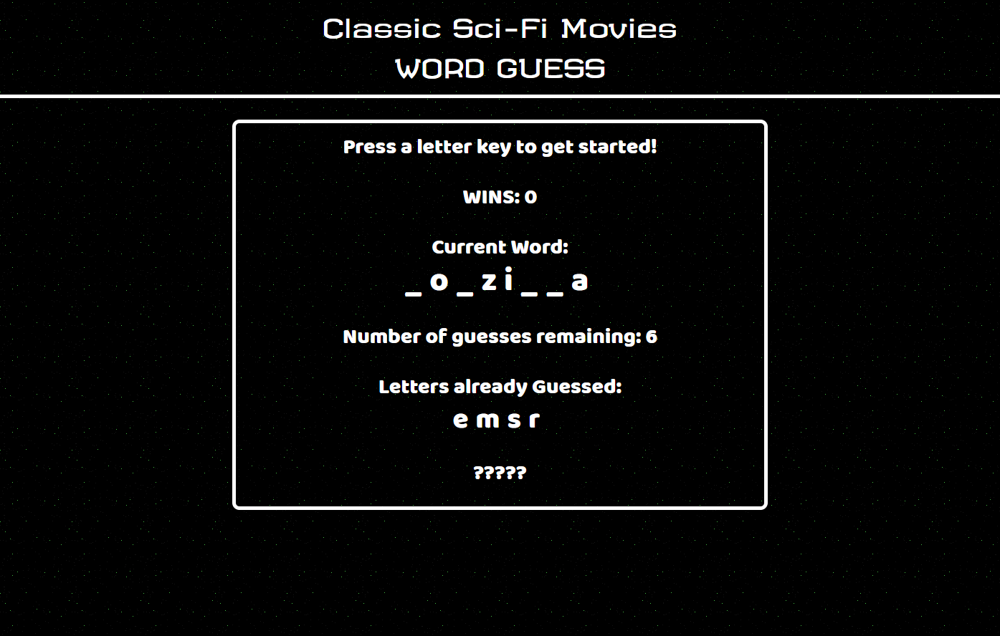
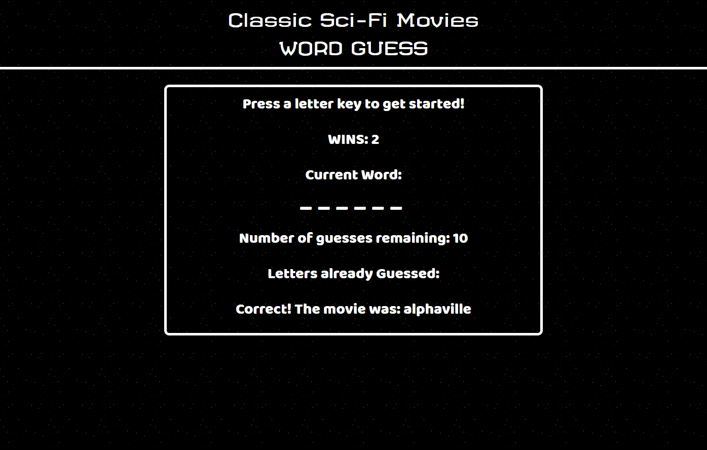
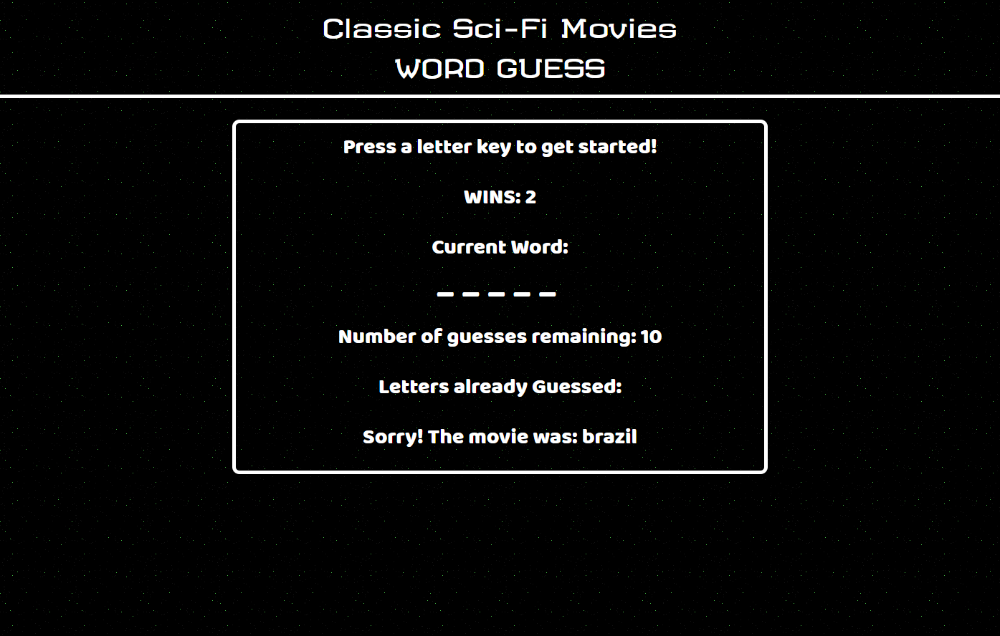

# Word-Guess-Game
## UNC Coding Bootcamp Homework #3  9-25-2018

This application is a word guess game modelled on the old standard "Hangman." The user attempts to guess the letters of the hidden word one by one until they've completed the word sucessfully, or they have run out of guesses (10 in this case.) A new word is then immediately chosen by the application.

The theme of the words is Sci-Fi Movie Titles (they are all one-word titles in this case.)

This app uses Javascipt for game logic and HTML and CSS for layout and styling.

### Screenshots

